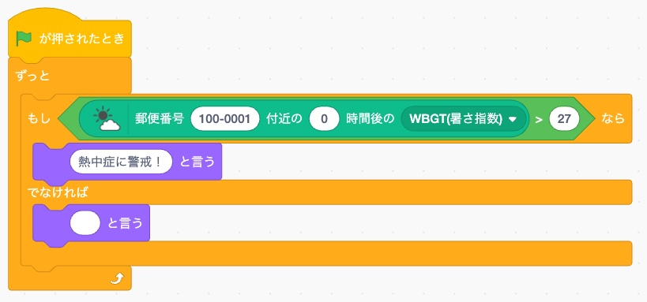

# 天気予報 (Weather Forecast)

[Xcratch](https://xcratch.github.io/) 用の天気予報拡張機能です。

郵便番号を指定するだけで、天気予報の値を返すレポーターブロックを追加します。

- **時間別予報**（n時間後）… 天気・気温・湿度・気圧・降水確率・降水量・風速・風向き・WBGT（暑さ指数）・UV指数
- **週間予報**（最大6日先）… 天気・最高気温・最低気温・降水確率・降水量・日の出・日の入り・日照時間
- **気象予報地点名** … 郵便番号付近で天気データに使われる地点の名前（日本語）

天気データは無料の [Open-Meteo](https://open-meteo.com/) API、郵便番号→緯度経度の変換は [HeartRails Geo API](https://geoapi.heartrails.com/) を利用しています（APIキー不要・インターネット接続が必要です）。

---

## ✨ この拡張でできること

サンプルプロジェクトを開くと、この「天気予報」拡張で何ができるかを試せます。

▶ [サンプルプロジェクトを開く](https://xcratch.github.io/editor/#https://asondemita.github.io/xcx-weather/projects/example.sb3?v=1.2.0)

<iframe src="https://xcratch.github.io/editor/player#https://asondemita.github.io/xcx-weather/projects/example.sb3?v=1.2.0" width="540px" height="460px"></iframe>

---

## ブロック一覧

| ブロック | 説明 |
|---|---|
| `郵便番号 [100-0001] 付近の [0] 時間後の (天気▼)` | 指定した郵便番号付近の、現在からn時間後の予報値を返します |
| `郵便番号 [100-0001] 付近の [0] 日後の (天気▼)` | 指定した郵便番号付近の、週間予報（最大6日先）の値を返します |
| `郵便番号 [100-0001] 付近の気象予報地点名` | その郵便番号付近で天気データに使われる地点の名前（日本語）を返します |

> ℹ️ **「付近」の意味（予報地点について）**
>
> このブロックが返すのは「郵便番号ピンポイントの天気」ではなく、「**その郵便番号付近（数km四方のエリア）の予報**」です。内部では次の2段階の近似が入ります。
>
> 1. 郵便番号 → そのエリアの**代表点1つ**（[HeartRails Geo API](https://geoapi.heartrails.com/) による緯度経度変換）
> 2. その代表点 → 気象モデルの**最寄り格子点**（[Open-Meteo](https://open-meteo.com/) が数km四方のセルにスナップ）
>
> どの地点に解決されたかは `郵便番号 [ZIP] 付近の気象予報地点名` ブロックで確認できます（日本語表記、例: `東京都千代田区`）。厳密な1点の天気ではない点にご注意ください。

### 時間別予報ブロック

`郵便番号 [ZIP] 付近の [n] 時間後の [項目▼]` は、現在からn時間後の予報値を返します。「n」は数字を直接入力します（デフォルト 0＝現在に最も近い毎正時）。

選べる項目（表示順）:

| 項目 | 内容 |
|---|---|
| 天気 | その時刻の天気（快晴 / 晴れ / 曇り / 小雨 / 雨 / 雪 / 雷雨 など。WMO天気コードを日本語化、[後述](#雨の強さの表しかた)。ごく弱い雨には「所により」が付くことがあります、[後述](#所によりが付くとき)） |
| 気温 | 摂氏（℃） |
| 湿度 | 相対湿度（%） |
| 気圧 | 海面気圧（hPa。天気予報で使われる、海面の高さに換算した気圧） |
| 降水確率 | **その時刻までの1時間**の降水確率（%。気象庁の降水確率とは別物、[後述](#週間予報の天気と降水確率の読みかた)） |
| 降水量 | **その時刻までの1時間**に降った雨・雪などの量（mm。[後述](#時間別の降水量降水確率はどの1時間か)） |
| 風速 | メートル毎秒（m/s） |
| 風向き | 16方位の日本語（北 / 北北東 / 北東 … 風が吹いてくる方向） |
| WBGT(暑さ指数) | 摂氏（℃）の推定値（[後述](#wbgt暑さ指数について)） |
| WBGT(危険度レベル) | ほぼ安全 / 注意 / 警戒 / 厳重警戒 / 危険 のいずれか（[後述](#wbgt暑さ指数について)） |
| UV指数 | 紫外線の強さの指数（0〜11+。小数1桁。ほかの項目より粗い別モデル由来で、格子点も一致しません） |

「n時間後」は **0以上の数字を直接入力**します（**半角・全角どちらでも可**。例: `3` / `１２`）。毎正時のデータに最も近い値を返すため、最大±30分程度のずれがあります。**予報期間（約3日先まで）を超える時間**や負の数・数字以外を入力した場合、誤った値を返さないよう**空の値**を返します。郵便番号が見つからない・通信に失敗した場合も空の値です。

郵便番号は **半角・全角どちらの数字でも、ハイフンの有無も問わず**入力できます（例: `100-0001` / `1000001` / `１０００００１` / `１００－０００１`）。7桁の数字として認識できない入力は空の値を返します。

#### 「所により」が付くとき

「晴れ所により小雨」のように、空模様に「所により」が付くことがあります。これは**雨が降る場所と降らない場所が混ざっている**という意味です。

Open-Meteo の雲量は面積の割合、降水量は数km四方の格子全体の平均値です。「雲量30%の空にごく弱い雨」という一見おかしな組み合わせは矛盾ではなく、**雨が格子より小さい範囲にまばらに降る**ことをモデルが表しています。日本の夏の午後によくある状態です。

この場合、その地点で実際に雨が観測されるのは1割ほどですが、20km以内まで広げると2割近くになります。「雨」と言い切るのも「晴れ」と言い切るのも実態と合わないので、含みのある言い方にしています。

時間別ブロックと週間ブロックで同じ判定をしています。ただし週間の「天気」は**2時間以上続いた雨**だけを採用するので、1時間だけの雨は時間別ブロックにしか出ません。

#### 雨の強さの表しかた

Open-Meteo の天気コード 51/53/55 は、規格上は「霧雨」ですが、実際には**雨粒の大きさを見ておらず降水量だけで決まっています**（気象庁の「霧雨」は直径0.5mm未満の雨粒による雨、という粒の大きさの定義です）。そこでこの拡張では、実態に合わせて雨の強さの言葉に置き換えています。

| 表示 | 実際の降水量 | 全国12都市×16日での出現率 |
|---|---|---|
| 小雨 | 0.03〜0.85 mm/h（中央値 0.10） | 23.0% |
| 弱い雨 | 0.20〜0.90 mm/h（中央値 0.60） | 3.5% |
| 弱い雨（強め） | 1.00〜1.20 mm/h | 0.7% |
| 雨（弱） | 1.30〜2.40 mm/h | 0.3% |
| 雨 | 2.70〜4.70 mm/h | 0.2% |

#### 時間別の「降水量」「降水確率」はどの1時間か

Open-Meteo の時間別の降水量・降水確率は、**その時刻の直前1時間**を表します（気温・湿度・気圧・風・天気はその時刻ちょうどの値です）。

つまり「**0**時間後の降水量」は**すでに降った分**、「**3**時間後の降水量」は**2時間後から3時間後まで**に降る量です。「これから1時間に降る量」を知りたいときは1つ先の時刻を指定してください。

### 週間予報ブロック

`郵便番号 [ZIP] 付近の [n] 日後の [項目▼]` は、日単位（週間）の予報値を返します。

- **日** … **0以上の数字を直接入力**します（**半角・全角どちらでも可**。デフォルト 0。0=今日 / 1=明日 / … 最大6＝6日後）。範囲外や数字以外は空の値を返します。
- **項目** … 次から選択

| 項目 | 内容 |
|---|---|
| 天気 | その日を代表する天気（日中の空模様＋夕方までの雨。[後述](#週間予報の天気と降水確率の読みかた)） |
| 最高気温 | 摂氏（℃） |
| 最低気温 | 摂氏（℃） |
| 降水確率 | その日の時間別降水確率の平均（%。[後述](#週間予報の天気と降水確率の読みかた)） |
| 降水量 | その日に降る雨・雪などの合計量（mm） |
| 日の出 | 時刻（HH:MM） |
| 日の入り | 時刻（HH:MM） |
| 日照時間 | その日に日が照る時間の合計（時間。例: 6.5） |

Open-Meteo の日別データと時間別データの両方を使っています。

| 項目 | 元データ |
|---|---|
| 最高気温 / 最低気温 / 降水量 / 日の出 / 日の入り / 日照時間 | 日別データをそのまま |
| 天気 | **時間別**の `weather_code` / `cloud_cover` / `precipitation` から組み立て（[後述](#週間予報の天気と降水確率の読みかた)） |
| 降水確率 | **時間別**の `precipitation_probability` を1日ぶん平均（[後述](#週間予報の天気と降水確率の読みかた)） |

日別の `weather_code` と `precipitation_probability_max` は、時間別データが取れなかったときの予備として使うだけです。

#### 週間予報の「天気」と「降水確率」の読みかた

週間予報の値を天気予報サイトと見比べると食い違って見えることがあります。バグではなく、元データの性質によるものです。

**「天気」は日中の空模様と、夕方までの雨から決めています。** Open-Meteo の日別 `weather_code` は24時間の最大値なので、未明に1時間だけ弱い雨があるだけで、日中ずっと晴れの日でも「雨」になってしまいます。そこで日別の値は使わず、時間別データから次のように決めています。

| | 扱い |
|---|---|
| 雨・にわか雨・雪・にわか雪・雷雨など | **6〜21時**に1時間でも出たら採用 |
| 小雨・弱い雨 | **6〜18時**に2時間以上続き、かつ雲量50%以上・降水量0.3mm/h以上のときだけ採用 |
| 霧 | 6〜18時に2時間以上続いたら採用（霧は晴れた夜にできるので雲量は問いません） |
| 上を満たさない弱い雨が2時間以上あるとき | 空模様に「所により」を付ける（[前述](#所によりが付くとき)） |
| どれもないとき | 日中の平均雲量から判定（50%未満 晴れ / 85%未満 晴れ（雲多め）/ それ以上 曇り） |

**雨や雷雨だけ21時まで見ているのは**、日本の暖候期は降水のピークが20〜21時にあるためです。アメダスの実測では 6〜18時だけだと1日の降水量の46%しか捕捉できず、雷雨の時間帯の32%を取りこぼしていました（21時までなら62%）。**22時以降と未明の雨は「天気」に出ません**ので、その時間帯が知りたいときは時間別ブロックで直接調べてください。

**「快晴」は週間予報では使いません。** 気象庁の用語集に「予報文には用いない」と明記されているためです（時間別ブロックには出ます）。なお雲量の境界のうち 85%（曇り）は気象庁の定義（雲量9以上）に沿っていますが、**50%（晴れ／晴れ（雲多め）の境目）はこの拡張が決めた線**です。そもそも気象庁の雲量は観測者が空全体を見て決めるもの、Open-Meteo の `cloud_cover` はモデルが格子ごとに出す面積率なので、別の量の数値を借りた目安と考えてください。

> 例1（東京 100-0001 / 2026-08-06 の実データ）: 未明の 00〜07時に弱い雨があり、08〜23時はずっと晴れで降水 0.0mm。日別 `weather_code` をそのまま使うと「弱い雨」ですが、このブロックは「晴れ」を返します。
>
> 例2（福岡 810-0001 / 2026-08-06 の実データ）: 日中13時間のうち12時間が雲量1〜13%。18時の1時間だけ雲量96%ですが、中身は上層雲96%・下層雲3%＝薄曇りです。日別 `weather_code` は「曇り」ですが、このブロックは「晴れ」を返します（気象庁の同日の予報も「晴れ」）。

**「降水確率」は、その日の時間別降水確率の平均です。** Open-Meteo が返すのは「1時間に0.1mm以上降る確率」で、気象庁の「6時間に1mm以上降る確率」とは定義が違います。日別データにある24時間の最大値をそのまま使うと24個の確率の最大を取ることになり、必ず大きく膨らみます。全国52地点×5日ぶんを気象庁の発表値と突き合わせた結果です。

| | 平均のずれ | 平均絶対誤差 | 相関 |
|---|---|---|---|
| 24時間の最大値（日別データそのまま） | +27.1 | 31.4 | 0.45 |
| **時間別の平均（この拡張）** | **−2.9** | **12.3** | **0.67** |

> 例（千葉県柏市 277-0005 / 2026-08-07 の実データ）: 日別データの最大値は 88% ですが、時間別の平均は 29% です（気象庁の同日の発表は 10%）。本当に降る日は高いままで、那覇 2026-08-07 は 98%（気象庁 90%）でした。

こちらは夜間も含めた**24時間**で平均しています。気象庁の日別の降水確率も6時間ごと4ブロックの最大で、うち2つは夜だからです（「天気」が日中中心なのとは逆になります）。それでも**別の量**なので、ぴったり一致はしません。

**「0日後（今日）の降水量」は、すでに降った分も含むその日1日の合計です。** 「これから降る量」ではありません。降水確率も1日を通した値なので、朝に見ても夜に見ても同じ数字になります。

---

## WBGT（暑さ指数）について

WBGT（湿球黒球温度＝暑さ指数）は、気温・湿度・日射・風速から熱中症のリスクを表す指標です。本拡張では Open-Meteo の予報値（気温・相対湿度・日射量・風速）から、**小野ら（2014）の屋外WBGT推定回帰式**を用いて計算しています。これは環境省が暑さ指数の実況・予測の算出に用いているのと同じ式です。

```
WBGT = 0.735×Ta + 0.0374×RH + 0.00292×Ta×RH
       + 7.619×SR − 4.557×SR² − 0.0572×WS − 4.064
```

| 記号 | 意味 | 元データ（Open-Meteo） |
|---|---|---|
| Ta | 気温（℃） | `temperature_2m` |
| RH | 相対湿度（%） | `relative_humidity_2m` |
| SR | 全天日射量（kW/m²） | `shortwave_radiation`（W/m² を 1/1000 換算。**直前1時間の平均値**なので、瞬間値である気温・湿度・風とは時間の取り方が揃っていません） |
| WS | 風速（m/s） | `wind_speed_10m` |

危険度レベルは、日本生気象学会「日常生活における熱中症予防指針」の区分に従います。

| WBGT（℃） | レベル |
|---|---|
| 21 未満 | ほぼ安全 |
| 21 以上 25 未満 | 注意 |
| 25 以上 28 未満 | 警戒 |
| 28 以上 31 未満 | 厳重警戒 |
| 31 以上 | 危険 |

### 熱中症アラートを作るには

プログラムで「熱中症アラート」を出したい場合は、**WBGT が 28 以上（＝「厳重警戒」以上）かどうか**で判定するのがおすすめです。環境省・日本生気象学会の指針でも、WBGT 28℃以上は熱中症の危険が高まり「激しい運動は中止」が推奨される目安とされています。

作例はこちらのサンプルプロジェクトで確認できます。

▶ [熱中症アラートのサンプルを開く](https://xcratch.github.io/editor/#https://asondemita.github.io/xcx-weather/projects/sample1.sb3?v=1.2.0)



より厳しめにしたい場合は 31 以上（「危険」）で判定します。

> ⚠️ **重要 — この値は推定値です**
>
> 本拡張のWBGTは「屋外・日向」を前提とした**推定値**であり、環境省が公表する公式の暑さ指数（WBGT）そのものではありません。計算式は同じでも、入力に用いる気象データの出どころが環境省（気象庁の数値予報など）とは異なるため、公式値とは一致しません。また日射量予報の精度に影響されます。
>
> **ずれの大きさの実測**（2026-08-06、8都市×13時間を環境省の実況推定値と比較）: 平均で −0.3℃、平均絶対誤差 0.9℃、最大 4.4℃。そして **約3割の時間帯で危険度レベルの区分が環境省と食い違いました**（例: 東京 15時 — 本拡張「危険」31.1℃ に対し環境省の予測値は「厳重警戒」29.0℃）。アラートを 28℃ で判定する場合、この差はレベル1つ分に相当します。
>
> また、環境省の **熱中症警戒アラートは WBGT 33（特別警戒は 35）** で発表されます。本拡張の最上位区分は 31 以上の「危険」なので、公式のアラートとは基準が違います。「危険」が出ていてもアラートは出ていない、ということが普通に起こります。
>
> **運動・作業の可否や熱中症対策などの最終判断は、必ず[環境省 熱中症予防情報サイト](https://www.wbgt.env.go.jp/)の公式値を参照してください。**

---

## Xcratch での使い方

この拡張は、[Xcratch](https://xcratch.github.io/) 上で他の拡張と組み合わせて使えます。

1. [Xcratch エディタ](https://xcratch.github.io/editor) を開く
2. 「拡張機能を追加」ボタンをクリック
3. 「Extension Loader」拡張を選ぶ
4. 入力欄に次のモジュールURLを入力する

   ```
   https://asondemita.github.io/xcx-weather/dist/weatherForecast.mjs
   ```

5. 「OK」ボタンをクリック
6. これでこの拡張のブロックが使えるようになります

---

## 開発

### 依存パッケージのインストール

```sh
npm install
```

### 開発環境のセットアップ

`./scripts/setup-dev.js` 内の `vmSrcOrg` を、ローカルの `scratch-vm` ディレクトリに合わせて変更してから、セットアップスクリプトを実行します。

```sh
npm run setup-dev
```

### APM による xcratch-skills のインストール

[APM (Agent Package Manager)](https://github.com/microsoft/apm) をインストールし、次を実行します。

```sh
apm install --target copilot
```

これで各エージェントクライアントにスキルが自動設定されます。インストール後は、次のような自然言語のトリガーフレーズが使えます。

| トリガーフレーズ | 呼び出されるスキル |
|---|---|
| `xcratch-create`, `scaffold extension` | `xcratch-extension-create` — 新しい拡張リポジトリを生成し、開発環境をセットアップ |
| `breakpoints not hit`, `debug on dev-server` | `xcratch-extension-debug` — ソースマップやローカルHTTPSの問題を修正 |
| `verify extension loads`, `check console errors` | `xcratch-extension-debug-auto` — エディタへ自動で移動し、読み込まれた拡張を検査 |
| `add to stretch3`, `stretch3-install` | `xcratch-extension-stretch3` — stretch3 用のインストールスクリプトとエントリファイルを生成 |

### モジュールへのバンドル

ビルドスクリプトを実行すると、この拡張を Xcratch で読み込めるモジュールファイルにバンドルします。

```sh
npm run build
```

### 変更を監視して自動ビルド

監視スクリプトを実行すると、ソースファイルの変更を検知して自動でバンドルします。

```sh
npm run watch
```

### テスト

テストスクリプトを実行して、この拡張をテストします。

```sh
npm run test
```

### バージョン管理とデプロイ

このプロジェクトでは、npm version コマンドと GitHub Actions を使ってバージョン管理とデプロイを行います。

#### 新しいバージョンを作成する

npm version コマンドでバージョン番号を更新します。これにより、次が自動で行われます。

1. `package.json` のバージョン更新
2. ビルドスクリプトの実行
3. バージョン別ビルドファイル（`dist/{version}/`）の作成
4. `dist/versions.json` への新バージョン情報の追記
5. git のコミットとタグの作成

```sh
# パッチ版 (1.3.0 → 1.3.1)
npm version patch

# マイナー版 (1.3.1 → 1.4.0)
npm version minor

# メジャー版 (1.4.0 → 2.0.0)
npm version major
```

#### GitHub Pages へのデプロイ

新しいバージョンを作成したら、タグをプッシュすると自動デプロイがトリガーされます。

```sh
# バージョンタグをプッシュ
git push origin v1.4.0

# またはすべてのタグをプッシュ
git push --tags
```

GitHub Actions のワークフローが次を実行します。

1. 拡張のビルド
2. `dist/`・`projects/`・`README.md` を GitHub Pages へデプロイ

GitHub の Actions タブから手動でデプロイをトリガーすることもできます。

#### バージョン情報

すべてのビルドバージョンは `dist/versions.json` に記録されます。

```json
{
  "extensionId": "weatherForecast",
  "latest": "1.0.0",
  "versions": [
    {
      "version": "1.0.0",
      "buildDate": "2025-10-19T12:34:56.789Z",
      "module": "1.0.0/weatherForecast.mjs"
    }
  ]
}
```

---

## クレジット / ライセンス

本拡張は、**無料・非商用の教育目的**で提供する個人プロジェクトです。

### 利用データと帰属表示

- **天気データ**: [Open-Meteo](https://open-meteo.com/) — データは [CC-BY 4.0](https://creativecommons.org/licenses/by/4.0/) で提供されています。
- **郵便番号→緯度経度・地名**: [HeartRails Geo API](https://geoapi.heartrails.com/) — 「位置参照情報」（国土交通省）等をもとに HeartRails が提供する無料の地理情報APIです。
- **WBGT（暑さ指数）の計算式**: 小野ら（2014）の屋外WBGT推定回帰式（環境省採用）。

### 利用上の注意

- **非商用利用について**: Open-Meteo の無料APIは**非商用利用に限られます**。本拡張を商用の製品・サービスに組み込むなど商用目的で利用する場合は、各自で [Open-Meteo の商用プラン](https://open-meteo.com/en/pricing) の契約が必要です。
- **レート制限**: Open-Meteo の無料枠は 1日10,000・1時間5,000・1分600リクエストです（IP単位）。学校など多数の端末が**同一のグローバルIP**を共有する環境では、合算で上限に達する場合があります。
- データはいずれも無保証です。特にWBGTは推定値のため、熱中症対策などの最終判断は[環境省の公式値](https://www.wbgt.env.go.jp/)を参照してください。

### コードのライセンス

本拡張のソースコードは [MIT License](./LICENSE) です。

## 🏠 ホームページ

このページは [https://asondemita.github.io/xcx-weather/](https://asondemita.github.io/xcx-weather/) から開けます。
